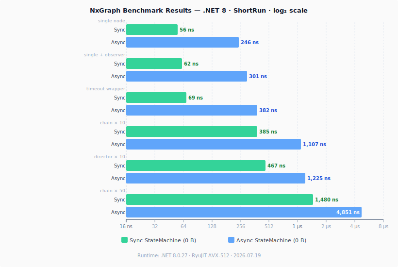

[](https://www.nuget.org/packages/NxGraph/)
[](https://www.nuget.org/packages/NxGraph.Serialization/)
[](https://www.nuget.org/packages/NxGraph.Serialization.Abstraction/)
[](LICENSE)

[](https://github.com/Enzx/NxGraph/actions/workflows/dotnet.yml)
[](https://github.com/Enzx/NxGraph/actions/workflows/publish-nuget.yml)

# NxGraph

NxGraph is a lean, high-performance finite state machine / stateflow library for .NET with:

- a fluent authoring DSL
- explicit branching through director nodes
- sync and async runtimes
- stepped execution for Unity (`Update()`-loop friendly)
- graph validation
- observers, tracing, replay, and Mermaid export
- optional graph serialization via a codec-based serializer

The core package targets `net8.0` and `netstandard2.1`.

---

## Table of contents

- [Why NxGraph](#why-nxgraph)
- [Packages](#packages)
- [Install](#install)
- [Quick start](#quick-start)
  - [Async quick start](#async-quick-start)
  - [Sync quick start](#sync-quick-start)
- [Authoring DSL](#authoring-dsl)
  - [Linear flows](#linear-flows)
  - [Branching with `If`](#branching-with-if)
  - [Branching with `Switch`](#branching-with-switch)
  - [Waits and timeouts](#waits-and-timeouts)
  - [Naming nodes](#naming-nodes)
  - [Agents / context injection](#agents--context-injection)
- [Execution](#execution)
  - [Async execution](#async-execution)
  - [Sync execution, stepped model](#sync-execution--stepped-model)
  - [Unity integration](#unity-integration)
  - [Nested machines](#nested-machines)
  - [Restart policy](#restart-policy)
- [Validation](#validation)
- [Observability](#observability)
  - [Observers](#observers)
  - [State logging](#state-logging)
  - [Tracing](#tracing)
  - [Replay](#replay)
- [Visualization](#visualization)
- [Serialization](#serialization)
- [Examples](#examples)
- [Benchmarks](#benchmarks)
- [Testing](#testing)
- [FAQ](#faq)
- [Roadmap](#roadmap)
- [Contributing](#contributing)
- [License](#license)

---

## Why NxGraph

- **Simple runtime model**: graphs are backed by dense node/transition arrays and each node has at most one direct outgoing edge.
- **Predictable branching**: fan-out happens through director nodes such as `ChoiceState` and `SwitchState<TKey>`.
- **Authoring ergonomics**: build flows with `StartWithAsync`, `.ToAsync(...)`, `.If(...)`, `.Switch(...)`, `.WaitForAsync(...)`, and `.ToWithTimeoutAsync(...)`.
- **Unity-ready sync runtime**: `StateMachine.Execute()` advances exactly one node per call, drop it into `MonoBehaviour.Update()`.
- **Diagnostics built in**: validate graphs, inspect Mermaid output, attach observers, capture replay logs, or emit `Activity` traces.
- **Both async and sync**: use `AsyncStateMachine` for async logic and `StateMachine` for sync-only flows.

---

## Packages

### `NxGraph`
The core package. Includes:

- graph model and FSM runtimes
- fluent DSL
- validation
- Mermaid export
- replay recording / playback
- tracing observer

### `NxGraph.Serialization`
Optional serializer package for persisting graphs to JSON or MessagePack using your own logic codec.

### `NxGraph.Serialization.Abstraction`
Optional interfaces for consumers who only need serialization contracts.

---

## Install

Core package:

```bash
dotnet add package NxGraph
```

Optional graph serialization:

```bash
dotnet add package NxGraph.Serialization
```

Optional serialization abstractions only:

```bash
dotnet add package NxGraph.Serialization.Abstraction
```

Build from source:

```bash
dotnet build -c Release
dotnet test -c Release
```

---

## Quick start

### Async quick start

```csharp
using NxGraph;
using NxGraph.Authoring;
using NxGraph.Fsm;

static ValueTask<Result> Acquire(CancellationToken _) => ResultHelpers.Success;
static ValueTask<Result> Process(CancellationToken _) => ResultHelpers.Success;
static ValueTask<Result> Release(CancellationToken _) => ResultHelpers.Success;

AsyncStateMachine fsm = GraphBuilder
    .StartWithAsync(Acquire).SetName("Acquire")
    .ToAsync(Process).SetName("Process")
    .ToAsync(Release).SetName("Release")
    .ToAsyncStateMachine();

Result result = await fsm.ExecuteAsync();
```

### Sync quick start

```csharp
using NxGraph;
using NxGraph.Authoring;
using NxGraph.Fsm;

StateMachine fsm = GraphBuilder
    .StartWith(() => Result.Success).SetName("Start")
    .To(() => Result.Success).SetName("End")
    .ToStateMachine();

// Execute() advances one node per call; loop to run to completion:
Result result = Result.Continue;
while (result == Result.Continue)
    result = fsm.Execute();
```

For a single-node graph `Execute()` returns `Result.Success` (or `Result.Failure`) immediately. For multi-node graphs it returns `Result.Continue` after each intermediate node, signalling that more nodes remain. See [Sync execution, stepped model](#sync-execution--stepped-model) for the Unity pattern.

---

## Authoring DSL

### Linear flows

```csharp
var graph = GraphBuilder
    .StartWithAsync(_ => ResultHelpers.Success).SetName("Start")
    .ToAsync(_ => ResultHelpers.Success).SetName("Step1")
    .ToAsync(_ => ResultHelpers.Success).SetName("Step2")
    .Build();
```

### Branching with `If`

```csharp
bool IsPremium() => true;

var graph = GraphBuilder
    .StartWithAsync(_ => ResultHelpers.Success).SetName("Entry")
    .If(IsPremium)
        .ThenAsync(_ => ResultHelpers.Success).SetName("Premium")
        .ElseAsync(_ => ResultHelpers.Success).SetName("Standard")
    .Build();
```

### Branching with `Switch`

```csharp
int RouteKey() => 2;

var graph = GraphBuilder
    .StartWithAsync(_ => ResultHelpers.Success).SetName("Entry")
    .Switch(RouteKey)
        .CaseAsync(1, _ => ResultHelpers.Success)
        .CaseAsync(2, _ => ResultHelpers.Success)
        .DefaultAsync(_ => ResultHelpers.Failure)
    .End().SetName("Router")
    .Build();
```

### Waits and timeouts

```csharp
var delayed = GraphBuilder
    .StartWithAsync(_ => ResultHelpers.Success).SetName("Start")
    .WaitForAsync(250.Milliseconds()).SetName("Cooldown")
    .ToAsync(_ => ResultHelpers.Success).SetName("Finish")
    .Build();

var timed = GraphBuilder
    .StartWithAsync(_ => ResultHelpers.Success).SetName("Start")
    .ToWithTimeoutAsync(2.Seconds(), _ => ResultHelpers.Success, TimeoutBehavior.Fail)
        .SetName("TimedWork")
    .ToAsync(_ => ResultHelpers.Success).SetName("AfterTimeout")
    .Build();
```

### Naming nodes

Names are optional but strongly recommended for diagnostics, Mermaid export, replay, and observer output.

```csharp
var graph = GraphBuilder
    .StartWithAsync(_ => ResultHelpers.Success).SetName("Initial")
    .ToAsync(_ => ResultHelpers.Success).SetName("Second")
    .Build()
    .SetName("SampleGraph");
```

### Agents / context injection

Use typed state machines when your states need shared mutable context or services.

```csharp
using NxGraph;
using NxGraph.Authoring;
using NxGraph.Fsm;

public sealed class AppAgent
{
    public int Counter { get; set; }
}

public sealed class WorkState : AsyncState<AppAgent>
{
    protected override ValueTask<Result> OnRunAsync(CancellationToken ct)
    {
        Agent.Counter++;
        return ResultHelpers.Success;
    }
}

AsyncStateMachine<AppAgent> fsm = GraphBuilder
    .StartWithAsync(new WorkState()).SetName("Work")
    .ToAsyncStateMachine<AppAgent>()
    .WithAgent(new AppAgent());

await fsm.ExecuteAsync();
```

---

## Execution

### Async execution

```csharp
AsyncStateMachine sm = graph.ToAsyncStateMachine(observer: null);
Result result = await sm.ExecuteAsync();
```

### Sync execution, stepped model

`StateMachine.Execute()` is the stepped entry point. Each call advances the machine by **exactly one node** and returns:

| Return value | Meaning |
|---|---|
| `Result.Continue` | Node completed; there are more nodes to run. Call `Execute()` again. |
| `Result.Success` | Machine finished successfully, no more nodes. |
| `Result.Failure` | A node failed or threw. Machine is now in `Failed` status. |

**Blocking / non-Unity loop:**

```csharp
StateMachine sm = graph.ToStateMachine();
Result result = Result.Continue;
while (result == Result.Continue)
    result = sm.Execute();
```

**Multi-frame nodes:** A node can return `Result.Continue` from its own `OnRun()` to signal it needs another frame (e.g. a countdown timer or a wait-for-input node). The machine stays on that node and invokes it again on the next `Execute()` call.

### Unity integration

Call `Execute()` from `MonoBehaviour.Update()`. The machine advances one node per frame and the main thread is never blocked:

```csharp
public class FsmRunner : MonoBehaviour
{
    private StateMachine _fsm;

    void Start()
    {
        _fsm = GraphBuilder
            .StartWith(new PatrolState()).SetName("Patrol")
            .To(new AlertState()).SetName("Alert")
            .To(new AttackState()).SetName("Attack")
            .ToStateMachine();
        _fsm.SetResetPolicy(RestartPolicy.Ignore);
    }

    void Update()
    {
        Result r = _fsm.Execute();
    }
}
```

### Nested machines

Both `StateMachine` and `AsyncStateMachine` implement the node interface directly, so a machine can be passed as a node inside another machine with no wrapper state required.

**Sync, stepped:**

```csharp
StateMachine childFsm = GraphBuilder
    .StartWith(() => Result.Success).SetName("Init")
    .To(new RelayState(
            run: () => Result.Success,
            onExit: () => Console.WriteLine("child done")))
    .ToStateMachine();

StateMachine parentFsm = GraphBuilder
    .StartWith(childFsm).SetName("Child")
    .To(new RelayState(
            run: () => Result.Success,
            onExit: () => Console.WriteLine("parent done")))
    .SetName("Cleanup")
    .ToStateMachine();

// Each Execute() advances exactly one node — even one inside the child.
// 3 ticks: child node 1 → child node 2 (child done) → parent Cleanup
Result r = Result.Continue;
while (r == Result.Continue)
    r = parentFsm.Execute();
```

From Unity's `Update()` each call advances exactly one node across the whole hierarchy — no frame blocking.

**Async:**

```csharp
AsyncStateMachine childFsm = GraphBuilder
    .StartWithAsync(_ => ResultHelpers.Success)
    .ToAsync(_ => ResultHelpers.Success)
    .ToAsyncStateMachine();

AsyncStateMachine parentFsm = GraphBuilder
    .StartWithAsync(childFsm)
    .ToAsync(_ => ResultHelpers.Success)
    .ToAsyncStateMachine();

Result result = await parentFsm.ExecuteAsync();
```

Nesting can be arbitrarily deep. Each level is stepped independently; the parent treats a running child as `Result.Continue` and a completed child as `Result.Success`.

### Restart policy

Control what happens after the machine reaches a terminal status (`Completed`, `Failed`, or `Cancelled`):

| Policy | Behaviour |
|---|---|
| `RestartPolicy.Auto` *(default)* | Automatically resets to `Ready`, ideal for Unity `Update()` loops |
| `RestartPolicy.Manual` | Stays terminal; re-execution throws until `Reset()` is called explicitly |
| `RestartPolicy.Ignore` | Stays terminal; further `Execute()` calls are no-ops that return the cached result |

```csharp
fsm.SetResetPolicy(RestartPolicy.Auto);

// Backwards-compatible alias:
fsm.SetAutoReset(true);  // maps to RestartPolicy.Auto
fsm.SetAutoReset(false); // maps to RestartPolicy.Manual
```

Additional notes on execution:

- reentrancy is guarded per machine instance, calling `Execute()` from inside a node throws
- async execution accepts cancellation tokens
- observer exceptions bubble to the caller by default
- graphs are immutable after `Build()` and can be shared across machine instances

---

## Validation

`Build()` already validates the graph. In `DEBUG`, invalid graphs throw immediately.

You can also validate a graph explicitly:

```csharp
using NxGraph.Diagnostics.Validations;

Graph graph = GraphBuilder
    .StartWithAsync(_ => ResultHelpers.Success)
    .ToAsync(_ => ResultHelpers.Success)
    .Build();

GraphValidationResult validation = graph.Validate();
if (validation.HasErrors)
{
    foreach (GraphDiagnostic diagnostic in validation.Diagnostics)
    {
        Console.WriteLine(diagnostic);
    }
}

graph.ValidateAndThrowIfErrorsDebug();
```

Validation checks include:

- broken transitions
- reachability from the start node
- self-loops (configurable)
- terminal path analysis for director-driven graphs

---

## Observability

### Observers

**Async observer:**

```csharp
using NxGraph.Fsm;
using NxGraph.Graphs;

public sealed class ConsoleObserver : IAsyncStateMachineObserver
{
    public ValueTask OnStateMachineStarted(NodeId graphId, CancellationToken ct = default)
    {
        Console.WriteLine($"FSM started: {graphId}");
        return ValueTask.CompletedTask;
    }

    public ValueTask OnStateEntered(NodeId id, CancellationToken ct = default)
    {
        Console.WriteLine($"Entered: {id.Name}");
        return ValueTask.CompletedTask;
    }

    public ValueTask OnTransition(NodeId from, NodeId to, CancellationToken ct = default)
    {
        Console.WriteLine($"Transition: {from.Name} -> {to.Name}");
        return ValueTask.CompletedTask;
    }

    public ValueTask OnStateExited(NodeId id, CancellationToken ct = default)
    {
        Console.WriteLine($"Exited: {id.Name}");
        return ValueTask.CompletedTask;
    }
}
```

**Sync observer** (`IStateMachineObserver`), all callbacks are `void` with default no-op implementations; override only what you need:

```csharp
using NxGraph.Fsm;
using NxGraph.Graphs;

public sealed class DiagnosticObserver : IStateMachineObserver
{
    // Node lifecycle
    public void OnStateEntered(NodeId id) => Console.WriteLine($">> {id.Name}");
    public void OnStateExited(NodeId id)  => Console.WriteLine($"<< {id.Name}");
    public void OnTransition(NodeId from, NodeId to) =>
        Console.WriteLine($"   {from.Name} -> {to.Name}");
    public void OnStateFailed(NodeId id, Exception ex) =>
        Console.WriteLine($"FAIL {id.Name}: {ex.Message}");

    // Machine lifecycle
    public void OnStateMachineStarted(NodeId graphId) =>
        Console.WriteLine($"FSM started: {graphId.Name}");
    public void OnStateMachineCompleted(NodeId graphId, Result result) =>
        Console.WriteLine($"FSM done: {result}");
    public void OnStateMachineReset(NodeId graphId) { }

    // Status changes (e.g. Created → Starting → Running → Completed)
    public void StateMachineStatusChanged(NodeId graphId, ExecutionStatus prev, ExecutionStatus next) { }

    // Log messages emitted by State.Log()
    public void OnLogReport(NodeId nodeId, string message) =>
        Console.WriteLine($"[{nodeId.Name}] {message}");
}
```

### State logging

Custom sync states can emit structured log messages through the observer without taking a direct dependency on a logger:

```csharp
using NxGraph.Fsm;

public sealed class WorkState : State
{
    protected override Result OnRun()
    {
        Log("starting heavy computation");
        // ... do work ...
        Log("computation complete");
        return Result.Success;
    }
}
```

`Log(message)` routes to `IStateMachineObserver.OnLogReport` when an observer is attached, and is a no-op otherwise.

### Tracing

On .NET 8+, `TracingObserver` emits `Activity` spans/tags for state machine and node execution.

```csharp
using NxGraph.Fsm;

IAsyncStateMachineObserver observer = new TracingObserver();
AsyncStateMachine fsm = graph.ToAsyncStateMachine(observer);
await fsm.ExecuteAsync();
```

This integrates naturally with OpenTelemetry pipelines listening to the `ActivitySource` named `"NxGraph"`.

### Replay

Capture a machine run and replay the event stream later:

```csharp
using NxGraph.Diagnostics.Replay;
using NxGraph.Fsm;

ReplayRecorder recorder = new();
AsyncStateMachine fsm = graph.ToAsyncStateMachine(recorder);
await fsm.ExecuteAsync();

StateMachineReplay replay = new(recorder.GetEvents().Span);
replay.ReplayAll(evt =>
{
    Console.WriteLine($"{evt.Type}: {evt.SourceId} -> {evt.TargetId} | {evt.Message}");
});

byte[] bytes = replay.Serialize();
ReplayEvent[] roundTripped = StateMachineReplay.Deserialize(bytes);
```

Replay persistence is its own binary event format; it is separate from graph serialization.

---

## Visualization

Export graphs to Mermaid for docs, PRs, or operations runbooks.

```csharp
using NxGraph.Diagnostics.Export;

string mermaid = GraphBuilder
    .StartWithAsync(_ => ResultHelpers.Success).SetName("Start")
    .ToAsync(_ => ResultHelpers.Success).SetName("Process")
    .ToAsync(_ => ResultHelpers.Success).SetName("End")
    .Build()
    .ToMermaid();

Console.WriteLine(mermaid);
```

---

## Serialization

`NxGraph.Serialization` serializes graphs using an application-provided logic codec.

Text codec example:

```csharp
using System.Text.Json;
using NxGraph;
using NxGraph.Authoring;
using NxGraph.Graphs;
using NxGraph.Serialization;

public sealed class ExampleState : IAsyncLogic
{
    public string Data { get; set; } = string.Empty;

    public ValueTask<Result> ExecuteAsync(CancellationToken ct = default)
        => ResultHelpers.Success;
}

public sealed class ExampleLogicCodec : ILogicTextCodec
{
    public string Serialize(IAsyncLogic data)
        => JsonSerializer.Serialize((ExampleState)data);

    public IAsyncLogic Deserialize(string payload)
        => JsonSerializer.Deserialize<ExampleState>(payload)
           ?? throw new InvalidOperationException("Failed to deserialize ExampleState.");
}

Graph graph = GraphBuilder
    .StartWithAsync(new ExampleState { Data = "start" }).SetName("Start")
    .ToAsync(new ExampleState { Data = "end" }).SetName("End")
    .Build()
    .SetName("ExampleGraph");

GraphSerializer serializer = new(new ExampleLogicCodec());

await using MemoryStream stream = new();
await serializer.ToJsonAsync(graph, stream);
stream.Position = 0;

Graph roundTripped = await serializer.FromJsonAsync(stream);
```

Notes:

- graph serialization is optional and lives in a separate package
- serializer usage is instance-based
- JSON and MessagePack are both supported through `GraphSerializer`
- your codec controls how node logic is persisted and restored

---

## Examples

The solution includes a runnable examples project with:

- a simple async FSM
- an AI enemy example
- Mermaid export example
- a sync Dungeon Crawler example using the DSL, observers, director nodes, loops, and named states

Run it with:

```bash
dotnet run --project NxFSM.Examples
```

---

## Benchmarks

Benchmarks live in `NxGraph.Benchmarks` and use BenchmarkDotNet. The suite covers both `AsyncStateMachine` and `StateMachine` (sync), and also measures equivalent Stateless scenarios for comparison.

Run them with:

```bash
dotnet run --project NxGraph.Benchmarks -c Release
```

### Results

> Runtime: .NET 8.0.26 (RyuJIT AVX-512F+CD+BW+DQ+VL+VBMI) · BenchmarkDotNet v0.13.12 · ShortRun job · 2026-04-27



**Async `AsyncStateMachine`:**

| Scenario | Mean | Alloc |
|---|---:|---:|
| Single node (`RelayState.Success`) ★ | 199 ns | 0 B |
| Single node + `NoopObserver` | 239 ns | 0 B |
| Timeout wrapper (immediate success) | 330 ns | 0 B |
| Chain × 10 nodes | 802 ns | 0 B |
| Director-driven × 10 nodes | 856 ns | 0 B |
| Chain × 50 nodes | 3,344 ns | 0 B |

**Sync `StateMachine`:**

| Scenario | Mean | Alloc |
|---|---:|---:|
| Single node ★ | 24 ns | 0 B |
| Single node + `SyncNoopObserver` | 27 ns | 0 B |
| Chain × 10 nodes | 194 ns | 0 B |
| Chain × 50 nodes | 979 ns | 0 B |

★ baseline

Key observations:

- **Zero allocations**, both runtimes are fully alloc-free after graph construction. The earlier 80 B figure was the `async Task<T>` wrapper on the benchmark method itself; benchmarks now return `ValueTask<Result>` directly.
- **Sync is ~8× faster on a single node**: 24 ns vs 199 ns, reflecting the absence of async machinery and `Interlocked` operations.
- **Observer overhead is constant** and runtime-dependent: +3 ns for sync, +40 ns for async, independent of chain length.
- **Per-node cost falls with chain length**: async 199 ns for 1 node → 80 ns/node for 10 → 67 ns/node for 50.
- **Sync per-node cost is consistent**: ~19 ns/node for both chain × 10 and chain × 50.
- **Director nodes** add ~54 ns over a plain 10-node async chain.

---

## Testing

Run the full test suite:

```bash
dotnet test -c Release
```

The tests cover:

- sync and async execution
- stepped execution (`SteppedExecutionTests`), one-node-per-tick semantics, multi-frame nodes, restart policies
- reentrancy and cancellation
- observers and log reports
- replay
- validation
- Mermaid export
- serialization round-trips

---

## FAQ

**Why is there only one direct outgoing transition per node?**  
Branching is modeled explicitly through directors such as `ChoiceState` and `SwitchState<TKey>`, which keeps execution simple and predictable.

**Can I share a graph across machines?**  
Yes. `Graph` is immutable after build and can be reused across multiple state machine instances.

**Do observer exceptions get swallowed?**  
No. They bubble by default.

**When should I name nodes?**  
Almost always. Names improve logs, observer output, replay traces, and Mermaid diagrams.

**Does the core package include Mermaid export and replay?**  
Yes. Those features are part of `NxGraph` itself; graph serialization is the optional extra package.

**Can I use NxGraph in Unity?**  
Yes. Use `StateMachine` (the sync runtime) and call `Execute()` from `MonoBehaviour.Update()`. `Execute()` advances exactly one node per call so the main thread is never blocked. Set `RestartPolicy.Auto` for automatic reset between runs, or `RestartPolicy.Ignore` to freeze the machine in its terminal state until you explicitly call `Reset()`. See [Unity integration](#unity-integration) for a full example.

**What does `Result.Continue` mean?**  
The machine has more nodes to process but is returning control to the caller (e.g. to avoid blocking a frame in Unity). Call `Execute()` again on the next frame. A node can also return `Result.Continue` from its own `OnRun()` to signal it needs multiple frames (e.g. a frame-based timer).

---

## Roadmap

- richer package docs and example coverage
- additional validation/reporting improvements
- more visualization tooling
- continued ergonomics improvements around DSL authoring and serialization

---

## Contributing

PRs are welcome. Please run formatting and tests before submitting:

```bash
dotnet test
```

---

## License

MIT. See [LICENSE](LICENSE) for details.
